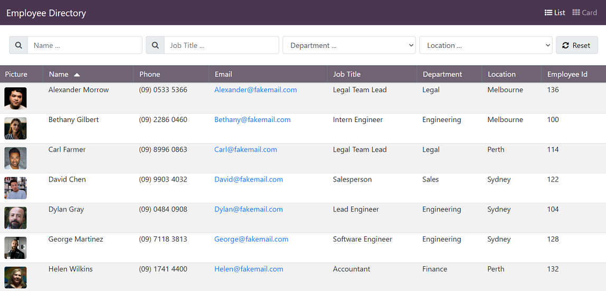
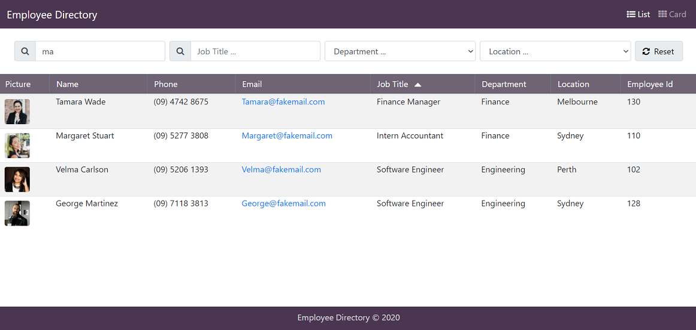
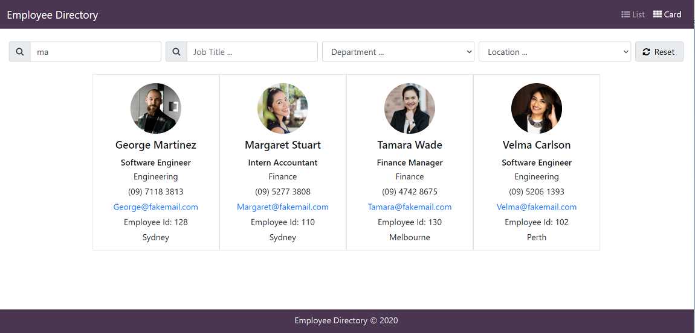

# Employee Directory

## Description 
 

  

The Employee Directory application lets users view a centralized searchable employee directory that contains non-sensitive data about all employees in their organization. Users can search for employees by name, job title, location and department and sort the results as well. The application additionally provides a card view where employee details can be viewed in a card layout.  

Deployed Application: [https://gveetil.github.io/React-Employee-Directory/](https://gveetil.github.io/React-Employee-Directory/)
  

## Table of Contents 

- [Technical Features](#technical-features)
 - [Reusability](#reusability)
 - [Responsive Web Design](#responsive-web-design)
- [Usage Guidelines](#usage-guidelines)
- [Known Issues](#known-issues)
  

## Technical Features

This application is built purely using React and Bootstrap and uses a json file as the data source.
It is currently published as a static site on GitHub Pages.  

### Reusability
This application is built using React components to facilitate re-usability. The table component built for this application uses configurable filters and sort columns that can easily be customized to work with other datasets as well.   

### Responsive Web Design 
This application is built using Responsive web design principles. Responsive web design provides better accessibility and an optimal viewing experience to the user, by ensuring that web pages render well on different devices and window / screen sizes. To achieve this, I have used the Bootstrap front-end component library to build my pages.

## Usage Guidelines

When the Employee Directory application is opened, it loads up all the employees in the system and displays the table below:  

  

* To filter employees, enter an employee's name / job title or select a department / location. 
* This will update the employee table list with the matching data.
* By default, the data will be sorted by employee name in ascending order.
* To change the sort column, click on a sortable column - Name, Job Title, Department, Location, or Employee Id. This will sort the table data by the given column. 
* Clicking on the current sort column again will change the sort direction.
* To clear the search, click the reset button. 
* To view employees in a card layout, select the card option from the navigation menu on top. This will bring up the card view:  
  
  

* When the card view is loaded up, the search filters entered in the table view are applied to the card view as well. Since the card view does not support sorting, the records are sorted by employee name in ascending order by default.
* The card view search works the same as in the table view.
* To return to the table view, select the list view option from the navigation menu on top.

## Known Issues

This application currently does not support sorting in the card layout view. I hope to add this in at a later point.